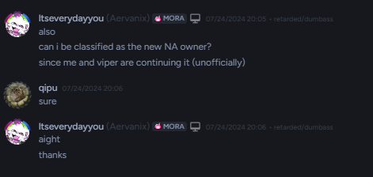

# hi tide you lil stalker (meat rider)

[](https://github.com/ltseverydayyou/Nameless-Admin/blob/main/LICENSE)

# Nameless Admin (Official Continuation)

Nameless Admin keeps the original script alive and adds new commands, fixes, and plugin support.

<p align="center">
  
</p>

---

## TL;DR
- Main: 
```
loadstring(game:HttpGet("https://raw.githubusercontent.com/ltseverydayyou/Nameless-Admin/main/Source.lua"))()
```
- Testing:
```
loadstring(game:HttpGet("https://raw.githubusercontent.com/ltseverydayyou/Nameless-Admin/main/NA%20testing.lua"))()
```
- Drop `.na` plugins in `Nameless-Admin/Plugins`
- Drop `.iy` (Infinite Yield style) plugins in `Nameless-Admin/PluginsIY`

---

## Quick Setup
1. Open your executor’s `Workspace` folder.
2. Make sure these folders exist (create if missing):
   - `Nameless-Admin/Plugins` for `.na` files
   - `Nameless-Admin/PluginsIY` for `.iy` files
3. Put your plugin files inside those folders.
4. Reload or execute the loader; the script will list what it loaded.

---

## Making a Simple `.na` Plugin
Put this in `Nameless-Admin/Plugins/hello.na`:

```lua
cmdPluginAdd = {
    Aliases = {"hello", "hi"},
    ArgsHint = "<name>",
    Info = "Say hi",
    Function = function(name)
        DoNotif("Hello "..tostring(name))
    end,
    RequiresArguments = true
}
```

You can also group multiple commands in one file:

```lua
cmdPluginAdd = {
    {
        Aliases = {"ping"},
        Info = "Replies with pong",
        Function = function() DoNotif("pong") end,
        RequiresArguments = false
    },
    {
        Aliases = {"say"},
        ArgsHint = "<text>",
        Info = "Repeat your text",
        Function = function(text) DoNotif(text) end,
        RequiresArguments = true
    }
}
```

---

## Making a Simple `.iy` Plugin
Put this in `Nameless-Admin/PluginsIY/example.iy`:

```lua
local Plugin = {
    PluginName = "ExamplePlugin",
    PluginDescription = "Shows how .iy maps to NA commands",
    Commands = {
        hello = {
            ListName = "hello/greet",
            Description = "Say hello",
            Aliases = {"hi"},
            Function = function(args, speaker)
                local name = args[1] or "world"
                DoNotif("Hello "..tostring(name))
            end,
        },
    },
}

return Plugin
```

Notes for `.iy`:
- `ListName` can include slashes for multiple names (e.g., `hello/greet`).
- `Aliases` adds extra names.
- `Function` receives `(args, speaker)`.

---

## Calling Other Commands From Plugins
- `cmdRun(...)`, `RunCommand(...)`, or `runCommand(...)`
- Works with:
  - a single string: `runCommand("fly 50")`
  - separate args: `runCommand("fly", "50")`
  - a token table: `runCommand({"fly","50"})`

---

## What Loads Where
When plugins load you’ll see a list like:

```
Loaded plugins:

example.na (hello, greet, hi)
```

---

## Maintainers
- [Vyperia (@ltseverydayyou)](https://github.com/ltseverydayyou)
- [Viper (@Cosmella)](https://github.com/Cosmella-v)

---

## Community
- Discord: [https://discord.gg/zzjYhtMGFD](https://discord.gg/zzjYhtMGFD)

---

## Credits (Original Owner)
- [FilteringEnabled](https://github.com/FilteringEnabled)
- [lxte](https://github.com/lxte)

---

## License
MIT — see [LICENSE](https://github.com/ltseverydayyou/Nameless-Admin/blob/main/LICENSE).
