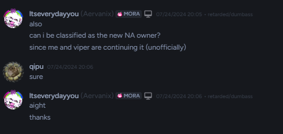

<div align="center">

# Nameless Admin

### Official continuation of the original Nameless Admin project

A cleaner, maintained Roblox admin utility with command execution, plugin loading, UI tooling, and compatibility-focused updates.

<p>
  <a href="https://github.com/ltseverydayyou/Nameless-Admin/blob/main/LICENSE">
    
  </a>
  <a href="https://github.com/ltseverydayyou/Nameless-Admin">
    
  </a>
  <a href="https://discord.gg/zzjYhtMGFD">
    
  </a>
  
</p>

<br>



</div>

---

## Overview

**Nameless Admin** keeps the original project alive while adding modern fixes, new commands, plugin support, and a cleaner user experience.

<table>
<tr>
<td width="50%">

### What it focuses on

- Fast script execution
- Admin-style command workflow
- `.na` plugin loading
- Infinite Yield-style `.iy` plugin loading
- Cleaner settings and file organization
- Continued fixes and maintenance

</td>
<td width="50%">

### Repository links

- **Main Source:** [`Source.lua`](Source.lua)
- **Testing Build:** [`NA testing.lua`](NA%20testing.lua)
- **License:** [`MIT`](LICENSE)
- **Community:** [Discord Server](https://discord.gg/zzjYhtMGFD)

</td>
</tr>
</table>

---

## Loaders

<details open>
<summary><b>Main Loader</b></summary>

```lua
loadstring(game:HttpGet("https://raw.githubusercontent.com/ltseverydayyou/Nameless-Admin/main/Source.lua"))()
```

</details>

<details>
<summary><b>Testing Loader</b></summary>

```lua
loadstring(game:HttpGet("https://raw.githubusercontent.com/ltseverydayyou/Nameless-Admin/main/NA%20testing.lua"))()
```

</details>

---

## Quick Setup

<details open>
<summary><b>Folder setup</b></summary>

Open your executor workspace folder and make sure these folders exist:

```text
Nameless-Admin/
├─ Plugins/
└─ PluginsIY/
```

| Folder | Purpose | File type |
|---|---|---|
| `Nameless-Admin/Plugins` | Nameless Admin plugin folder | `.na` |
| `Nameless-Admin/PluginsIY` | Infinite Yield-style plugin folder | `.iy` |

After placing plugin files inside the correct folder, reload or execute the loader again. Loaded plugins will be listed by the script.

</details>

---

## Plugin System

<details open>
<summary><b>Create a simple <code>.na</code> plugin</b></summary>

Put this inside:

```text
Nameless-Admin/Plugins/hello.na
```

```lua
cmdPluginAdd = {
    Aliases = {"hello", "hi"},
    ArgsHint = "<name>",
    Info = "Say hi",
    Function = function(name)
        DoNotif("Hello "..tostring(name))
    end,
    RequiresArguments = true
}
```

</details>

<details>
<summary><b>Add multiple <code>.na</code> commands in one plugin</b></summary>

```lua
cmdPluginAdd = {
    {
        Aliases = {"ping"},
        Info = "Replies with pong",
        Function = function()
            DoNotif("pong")
        end,
        RequiresArguments = false
    },
    {
        Aliases = {"say"},
        ArgsHint = "<text>",
        Info = "Repeat your text",
        Function = function(text)
            DoNotif(text)
        end,
        RequiresArguments = true
    }
}
```

</details>

<details>
<summary><b>Create an Infinite Yield-style <code>.iy</code> plugin</b></summary>

Put this inside:

```text
Nameless-Admin/PluginsIY/example.iy
```

```lua
local Plugin = {
    PluginName = "ExamplePlugin",
    PluginDescription = "Shows how .iy maps to NA commands",
    Commands = {
        hello = {
            ListName = "hello/greet",
            Description = "Say hello",
            Aliases = {"hi"},
            Function = function(args, speaker)
                local name = args[1] or "world"
                DoNotif("Hello "..tostring(name))
            end,
        },
    },
}

return Plugin
```

### `.iy` notes

| Field | Behavior |
|---|---|
| `ListName` | Can include slashes for multiple command names, such as `hello/greet` |
| `Aliases` | Adds extra command names |
| `Function` | Receives `(args, speaker)` |

</details>

---

## Calling Commands From Plugins

<details>
<summary><b>Supported command call formats</b></summary>

Plugins can call existing commands through:

```lua
cmdRun(...)
RunCommand(...)
runCommand(...)
```

Supported formats:

```lua
runCommand("fly 50")
runCommand("fly", "50")
runCommand({"fly", "50"})
```

</details>

---

## Loaded Plugin Output

<details>
<summary><b>Example loader output</b></summary>

When plugins load successfully, you should see output similar to this:

```text
Loaded plugins:

example.na (hello, greet, hi)
```

</details>

---

## Structure

<details>
<summary><b>Recommended workspace layout</b></summary>

```text
Workspace/
└─ Nameless-Admin/
   ├─ Plugins/
   │  └─ hello.na
   └─ PluginsIY/
      └─ example.iy
```

</details>

<details>
<summary><b>Common plugin checklist</b></summary>

- Use `.na` files for native Nameless Admin plugins.
- Use `.iy` files for Infinite Yield-style plugins.
- Reload the script after adding or editing plugins.
- Keep command aliases short and unique.
- Use `RequiresArguments = true` only when the command needs input.

</details>

---

## Maintainers

<table>
<tr>
<td align="center" width="50%">
<a href="https://github.com/ltseverydayyou">
<br>
<b>Vyperia</b><br>
<sub>@ltseverydayyou</sub>
</a>
</td>
<td align="center" width="50%">
<a href="https://github.com/Cosmella-v">
<br>
<b>Viper</b><br>
<sub>@Cosmella</sub>
</a>
</td>
</tr>
</table>

---

## Community

Join the community server for updates, support, and discussion:

<div align="center">

[](https://discord.gg/zzjYhtMGFD)

</div>

---

## Credits

Original project credits:

- [FilteringEnabled](https://github.com/FilteringEnabled)
- [lxte](https://github.com/lxte)

---

## License

This project is licensed under the **MIT License**. See [`LICENSE`](LICENSE) for details.
